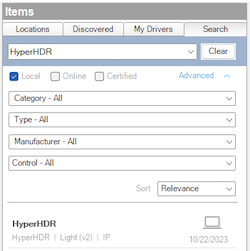

---

# Overview

> DISCLAIMER: This software is neither affiliated with nor endorsed by either
> Control4 or HyperHDR.

Seamlessly control your HyperHDR instance from Control4.

# System requirements

- Control4 OS 3.3+

# Features

- Set color, video, and effects from Control4 navigators and/or programming
- 2-way real-time communication
- Complete light_v2 proxy implementation with advance lighting support
- Automatic updates
- Easy and maintenance free installation

# Driver Setup

Driver installation and setup is similar to most other cloud based drivers.
Below is an outline of the basic steps for your convenience.

1. Download the `control4-hyperhdr.zip` from the
   [latest GitHub release](https://github.com/black-ops-drivers/control4-hyperhdr/releases/latest).
2. Extract and
   [install](<(https://www.control4.com/help/c4/software/cpro/dealer-composer-help/content/composerpro_userguide/adding_drivers_manually.htm)>)
   the `hyperhdr.c4z` driver.
3. Use the "Search" tab to find the "HyperHDR" driver and add it to your
   project.

   > ⚠️ Only a **_single_** controller driver instance is required per HyperHDR
   > instance.

   

4. Configure the [Server Settings](#server-settings) with the connection
   information.
5. After a few moments the [`Driver Status`](#driver-status-read-only) will
   display `Connected`. If the driver fails to connect, set the
   [`Log Mode`](#log-mode--off--print--log--print-and-log-) property to `Print`
   and click the [`Connect`](#connect) action to trigger a reconnect. Then check
   the lua output window for more information.

## Driver Properties

### Cloud Settings

#### Automatic Updates

Turns on/off the GitHub cloud automatic updates.

#### Update Channel

Sets the update channel for which releases to consider during an automatic
update from the GitHub repo releases.

### Driver Settings

#### Driver Status (read only)

Displays the current status of the driver.

#### Driver Version (read only)

Displays the current version of the driver.

#### Log Level [ Fatal | Error | Warning | **_Info_** | Debug | Trace | Ultra ]

Sets the logging level. Default is `Info`.

#### Log Mode [ **_Off_** | Print | Log | Print and Log ]

Sets the logging mode. Default is `Off`.

### Server Settings

> ⚠️ Once all the following server setting fields are set, the driver will
> attempt to connect to the server. If this is not desired, you can send the
> `Disconnect` command in the `Actions` tab. In order to reconnect, you must
> later send the `Connect` command from the same `Actions` tab.

#### Server IP

Sets the server IP address (eg. `192.168.1.30`). Domain names are allowed as
long as they can be resolved to an accessible IP address by the controller.
HTTPS is not supported.

> ⚠️ If you are using an IP address you should ensure it will not change by
> assigning a static IP or creating a DHCP reservation.

#### Server Port

Sets the HTTP server port (eg. `8090`).

#### Token

Sets the server API token.

## Driver Actions

### Synchronize

Synchronize the state between the driver and the HyperHDR server. This should
generally be unnecessary to perform as the driver synchronizes itself on a
regular interval, but is exposed here if you wish to trigger the process
manually.

### Connect

Trigger the driver to connect to the HyperHDR server. The driver will
automatically attempt to connect when all the
[Server Settings](#server-settings) are present, unless the driver
[Disconnect](#disconnect) action was previously performed.

### Disconnect

Trigger the driver to disconnect from the HyperHDR server. The driver will not
attempt to reconnect until the [Connect](#connect) action is performed.

### Update Drivers

Trigger the driver to update from the latest release on GitHub, regardless of
the current version.

# Support

If you have any questions or issues integrating this driver with Control4 you
can file an issue on GitHub:

https://github.com/black-ops-drivers/control4-hyperhdr/issues/new

# Changelog

[//]: # "## v[Version] - YYY-MM-DD"
[//]: # "### Added"
[//]: # "- Added"
[//]: # "### Fixed"
[//]: # "- Fixed"
[//]: # "### Changed"
[//]: # "- Changed"
[//]: # "### Removed"
[//]: # "- Removed"

## v20231022 - 2023-10-22

### Added

- Initial Release
